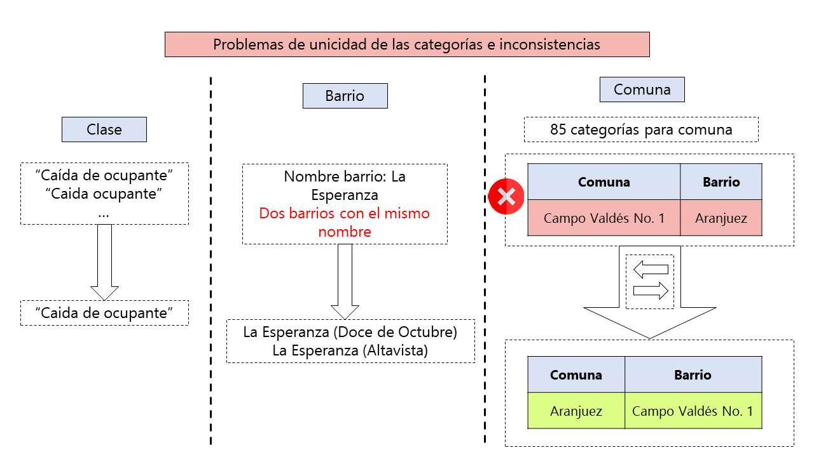
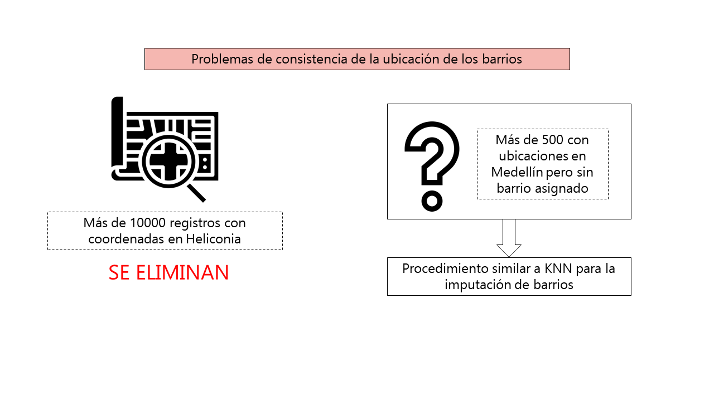
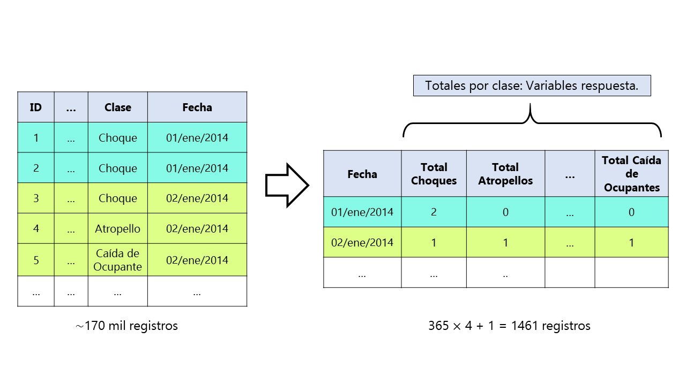
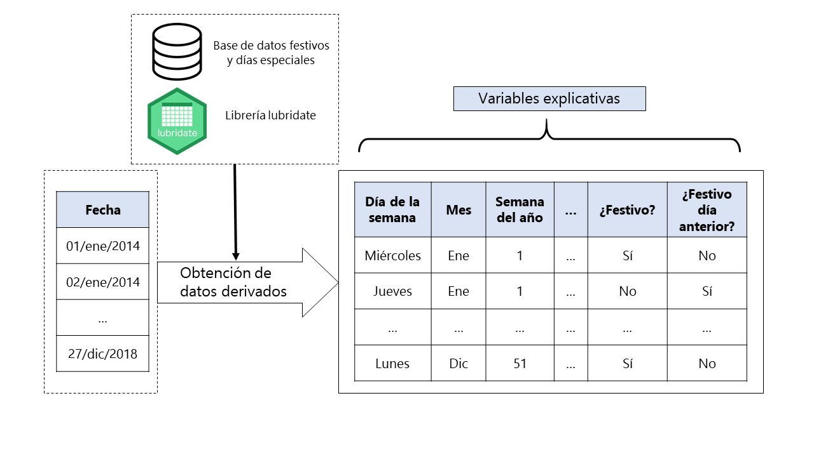
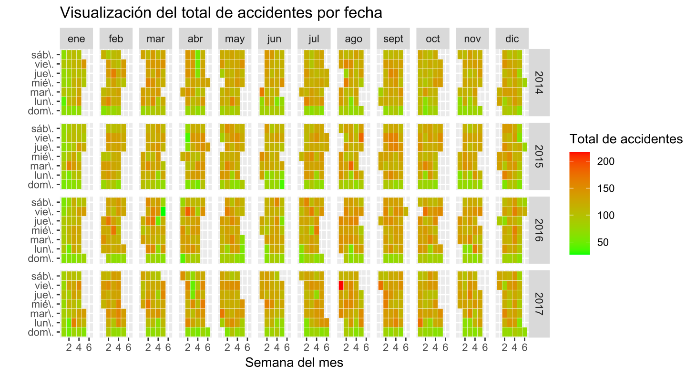
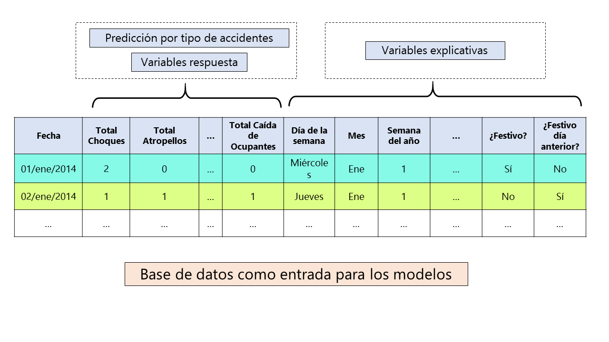
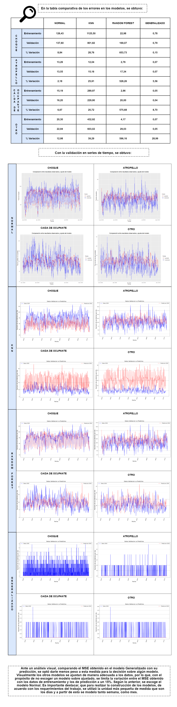

<html>
<head><title>CrashMED</title></head>
<body>

<h2>Accidentalidad en Medellín</h2>

<h2>Carga, extracción, depuración y transformación de datos</h2>
<h5>Para visualizar mas sobre el proceso de carga, extracción, depuración y transformación de dato, pulsar el boton que se encuentra a continuación. </h5>

<a class="example_f" href="01_Depuracion_BD.html" target="_blank" rel="nofollow">Depuración Base de Datos</a>

<h5>Para visualizar mas sobre el proceso de ajuste realizado a los barrios, pulsar el boton que se encuentra a continuación. </h5>

<a class="example_f" href="02_Barrios.html" target="_blank" rel="nofollow">Ajuste realizado a barrios</a>

<h5>Para visualizar mas sobre el proceso de transformación a la base de datos, pulsar el boton que se encuentra a continuación. </h5>

<a class="example_f" href="03_Transformacion_BD.html" target="_blank" rel="nofollow">Transformación a la base de datos</a>

<h5>Para visualizar mas sobre el proceso para obtención de festivos y otras variables, pulsar el boton que se encuentra a continuación. </h5>

<a class="example_f" href="04_FechasEspeciales01.html" target="_blank" rel="nofollow">Obtención de festivos y otras variables</a>

<h5>Para visualizar mas sobre los ajustes adicionales, pulsar el boton que se encuentra a continuación. </h5>

<a class="example_f" href="05_FechasEspeciales02.html" target="_blank" rel="nofollow">Ajustes adicionales</a>

<h2>Analisis descriptivo</h2>

<h2>Agrupamiento</h2>
<h5>Para visualizar mas sobre el proceso de agrupamiento, pulsar el boton que se encuentra a continuación. </h5>

<a class="example_f" href="AgrupacionFinal.html" target="_blank" rel="nofollow">Agrupamiento</a>

<h2>Modelamiento</h2>

<h3>A continuación puede seleccionar el desarrollo de los modelos analizados:</h3>

  <a href="07_ModeloNormal.html"><button>Modelo Normal</button></a>
  <a href="Random Forest.html"><button>Random Forest</button></a>
  <a href="KNN.html"><button>K vecinos mas proximos</button></a>
  <a href="Generalizado.html"><button>Modelo Generalizado</button></a>

</body>
</html>

<html>
<head>

</head>
<body>

</body>
</html>
